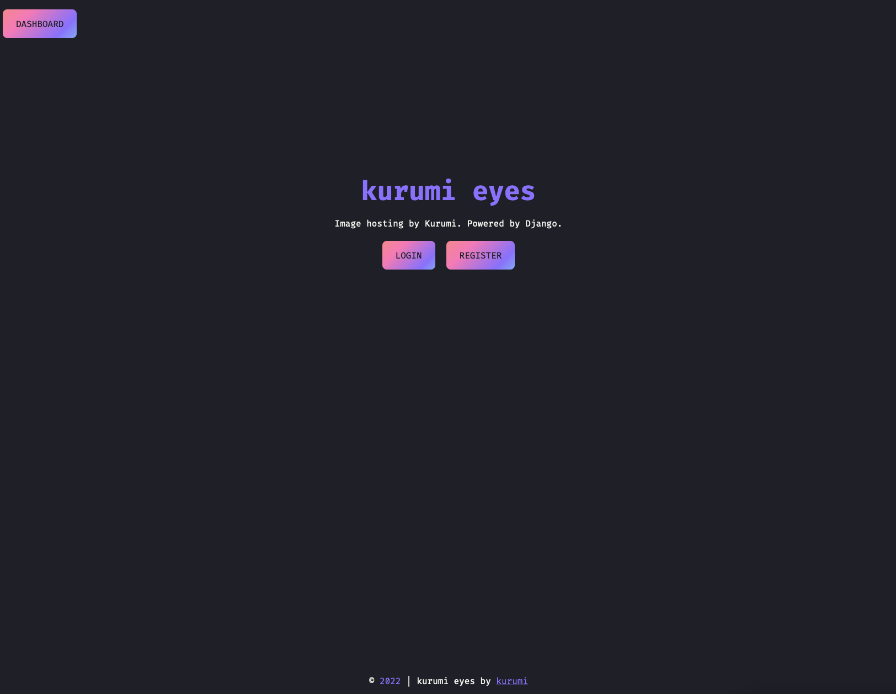
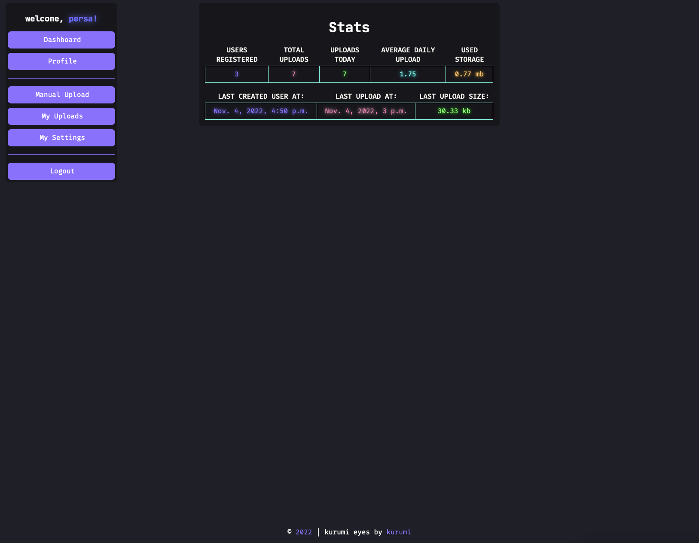
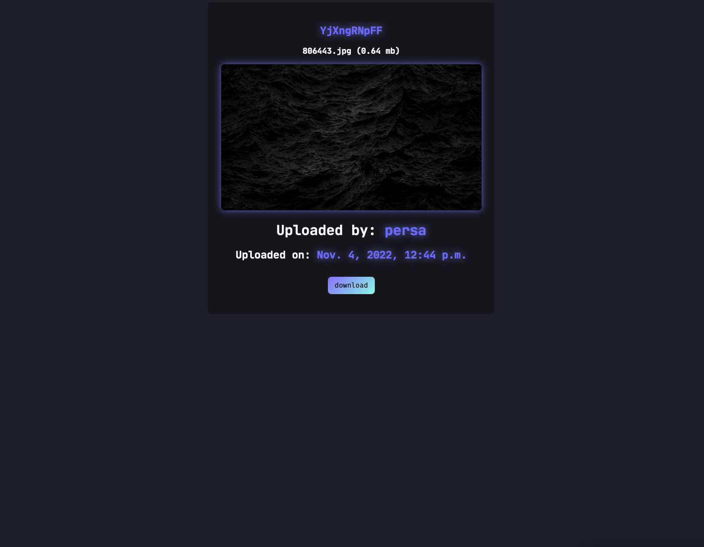
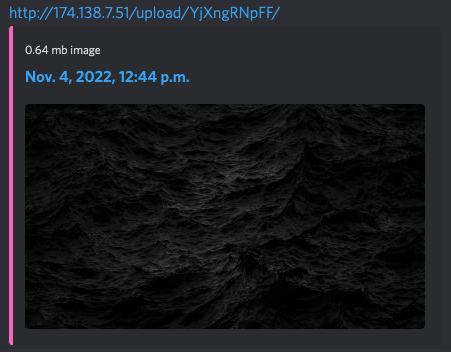

    <h1>Kurumi-Eyes</h1>
    <h2>An image hosting service built with Django and Django REST. Styles made with Dracula-UI.</h2>
     
    
Users can upload and manage images, receive a custom upload info page with auto generated meta tags.

     
    
REST API suitable for apps like ShareX and others screenshot tools.

     
    
Current live version only available with a invite-code.

    <a href="kurumi-eyes.cyou" target="_blank">kurumi-eyes.cyou</a>
    <h1>Screenshots:</h1>
    
    <h2>Built-in daily stats</h2>
    
    <h2>Custom upload info with random slug</h2>
    
    <h2>Auto generated META for social platforms (Discord, Twitter, Slack & Etc)</h2>
    

